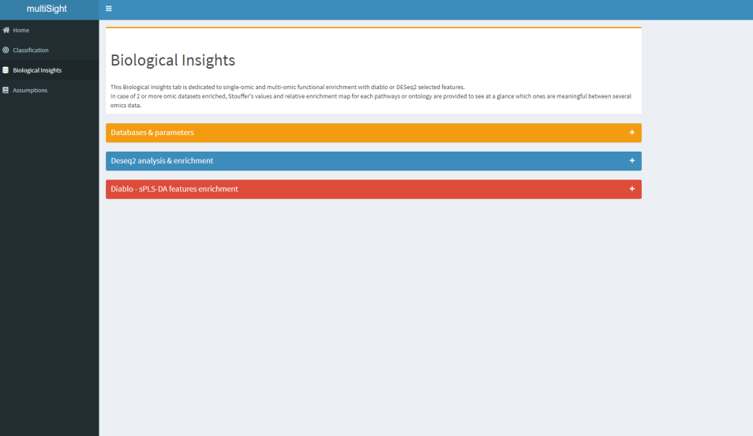
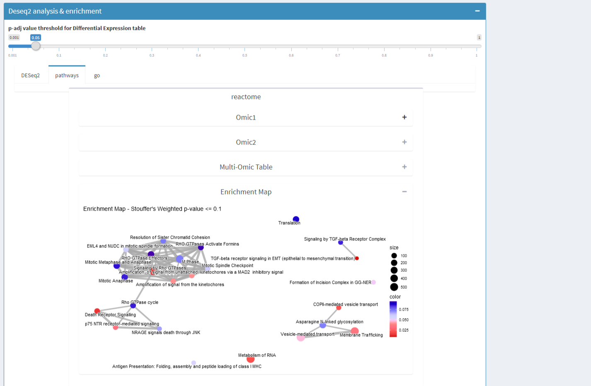

<!-- README.md is generated from README.Rmd. Please edit that file -->

```{r, include = FALSE}
knitr::opts_chunk$set(
  collapse = TRUE,
  comment = "#>",
  fig.path = "man/figures/README-",
  out.width = "100%"
)
```

<!-- badges: start -->
[](https://GitHub.com/Naereen/StrapDown.js/graphs/commit-activity)
[](https://www.tidyverse.org/lifecycle/#experimental)

<!--  -->
<!-- badges: end -->

 

# **multiSight** 

:rocket: The purpose of this document is to help you become productive as 
quickly as possible with the **multiSight** package.

- The goal of **multiSight** is to handle multi-omics data and network inference
in a easy-to-use R shiny package.

> You could use this tool with a graphical interface or only with 
script functions (see **Vignette** and *manual* for detailed examples).

# Installation

You can install the released version of **multiSight** from
[Bioconductor](https://www.bioconductor.org/) with:

```{r, eval = FALSE}
#To install this package ensure you have BiocManager installed
if (!requireNamespace("BiocManager", quietly = TRUE))
    install.packages("BiocManager")

#The following initializes usage of Bioc devel
BiocManager::install("multiSight")
```

# **multiSight** purpose

**multiSight** is a R package providing an user-friendly graphical interface to 
analyze and explore your omic datasets in a __multi-omics__ manner by _DESeq2_ 
(see **Biological Insights tab**), machine learning methods with _biosigner_ 
and _multi-block statistical analysis_ (see **Classification tab**) helped by
_p-values pooling Stouffer's_ method.

Classification models are fitted to 
select few subsets of features, using **biosigner** or **sPLS-DA methods**.
*biosigner* provides one model by omic block and one list of features named 
*biosignature*. 
Nevertheless, sPLS-DA *biosignatures* are based on more features than 
*biosigner*.

**Biosignatures** can be used:

- To forecast phenotype (e.g. to diagnostic tasks, histological subtyping);
- To design _**Pathways**_ and _**gene ontology**_ **enrichments** 
(sPLS-DA biosignatures only);
- To build _**Network inference**_;
- To find _**PubMed**_ references to make assumptions easier and data-driven.

# :newspaper: App

**multiSight** enables you to get better biological insights for each omic 
dataset helping by __four analytic modules__ which content:

- :memo: __Data input__ & __results__;
- :dart: __Classification__ models building;
- :books: __Biological databases__ querying;
- :seedling: __Network Inference__ & __PubMed__ querying.

> :point_right: Run the application

```{r eval=FALSE, include=TRUE}
run_app()
```

| :memo: Home                                 | :dart: Classification                                | :books: Biological Insights                          | :seedling: Assumption                               |
|--------------------------------------|-----------------------------------------------|----------------------------------------------|------------------------------------------|
|  |  |  |  |

# What kind of data? 

All types of omic data respecting input format is supported to build 
**classification models**, **biosignatures** selection and
**network inference**.

- Genomics;
- Transcriptomics;
- Proteomics;
- Metabolomics;
- Lipidomics;

> :point_right: In fact all numeric matrices.

## Data inputs formats

You have to provide two types of data: **numeric matrices** and 
**classes vector** as csv tables for all **same samples**.

| Omic data 1 |        |        |        |     |
|-------------|--------|--------|--------|-----|
|             | SIGIRR | MAOA | MANSC1 |     |
| AOFJ        | 0      | 150    | 1004   | ... |
| A13E        | 34     | 0      | 0      |     |
|             |        | ...    |        |     |

| Omic data 2 |                 |                 |                 |     |
|-------------|-----------------|-----------------|-----------------|-----|
|             | ENSG00000139618 | ENSG00000226023 | ENSG00000198695 |     |
| AOFJ        | 25              | 42              | 423             | ... |
| A13E        | 0               | 154             | 4900            |     |
|             |                 | ...             |                 |     |

... :point_right: unlimited number of omic datasets.

| Omic data n |                 |                 |                 |     |
|-------------|-----------------|-----------------|-----------------|-----|
|             | 4292 | 5254 | 7432 |     |
| AOFJ        | 25              | 42              | 423             | ... |
| A13E        | 0               | 154             | 4900            |     |
|             |                 | ...             |                 |     |

| Omic classes |       |
|--------------|-------|
|              | Y     |
| AOFJ         | condA |
| A13E         | condB |
|              | ...   |

# :dart: Classification tab

Two types of models have been implemented so far to answer different 
questions: [**biosigner**](https://doi.org/10.3389/fmolb.2016.00026) & 
[**sPLS-DA (DIABLO)**](https://doi.org/10.1093/bioinformatics/bty1054) .

- To determine *small biosignatures* - biosigner.
- To build *classification models* in a *multi-omics* way - DIABLO.
- To select relevant biological *features* to *enrich* - DIABLO.

| Features selected                             | Performances                                  |
|-----------------------------------------------|-----------------------------------------------|
|  |  |

# :books: Biological insights tab

**Biological Insight** tab is dedicated to give biological sense to your data. 

- You could process ___2 analysis in 2 clicks___: both *DESeq2* and 
*DIABLO features* ORAs for functional enrichment.

## Biological Annotation Databases

**multiSight** uses so far **several databases** to provide a large panel of 
**enrichment analysis**, automatically after few clicks:

**Pathways** and **Gene Ontology** databases are implemented, helped by 
**clusterProfiler** and **reactomePA** R Bioconductor packages.

- Kegg;
- Reactome;
- wikiPathways;
- Molecular Function (GO)
- Cellular Component (GO)
- Biological Process (GO)

## Visualizations

Two types of result visualization are given:

- Classical **Enrichment tables** for each omic and each database (e.g. 
Pathways id, p-value, padjust columns).
- And, when more than one omic enriched: a *Multi-omics table* and a 
*multi-omics enrichment map* for **DESeq2** and *DIABLO selected features*.

| DESeq2 & DIABLO features                    | Enrichment tables                            | Enrichment Map                                |
|---------------------------------------------|----------------------------------------------|-----------------------------------------------|
|  |  |  |

# :seedling: Assumption tab

> :point_right: Some clicks (from 4 to number of PubMed queries)

**Assumption tab** aims to help biological hypothesis making by *network 
inference* from feature relationship values (e.g correlation, 
partial correlation) and by a *PubMed module*.

You can find both functions:

- To compute _*network inference*_ and to reveal feature relationships.
- To get _*PubMed articles*_ based on your personalized query without leaving 
app.

| Network Inference                       | PubMed query                             |
|-----------------------------------------|------------------------------------------|
|  |  |


# :checkered_flag: Results

You could retrieve different results computed by multiSight in Home tab by:

- Automatic report with all results in **HTML** and **.doc** documents.
- **.RData** with all results obtained by the graphical application.

Note that tables could be downloaded in a separated way in relative tabs.

> **MODELS**: classification models you can use on future data.

> **DESeq2**: differential expression analysis tables.

> **BIOSIGNATURES**: DESeq2  tables thresholding and DIABLO multi-omics features 
selection method

> **Functional ENRICHMENTS**: 6 databases functional enrichment for all omic 
datasets you provide enriched by Stouffer's pooling p-value method giving 
a **multi-omics enrichmentt able** easily to discuss.

> **NETWORKS**: network inference analysis with all features selected from 
all omic datasets according to DESeq2 tables thresholding or multi-omics feature 
selection (correlation, partial correlation, mutual information).

> **BIBLIOGRAPHY** : a subset of PubMed articles relative to relations you choose 
in network inference tab. 