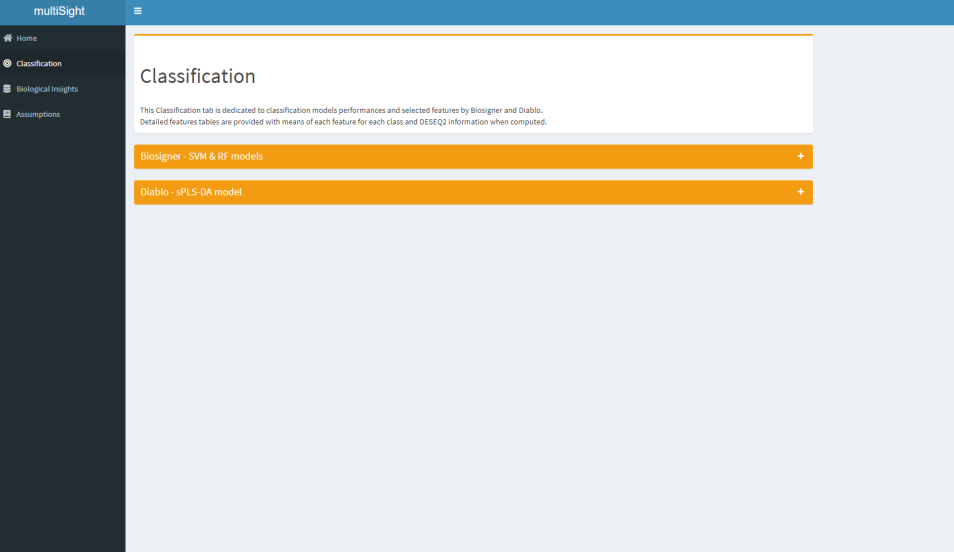

<!-- README.md is generated from README.Rmd. Please edit that file -->

<!-- badges: start -->

[](https://GitHub.com/Naereen/StrapDown.js/graphs/commit-activity)
[](https://www.tidyverse.org/lifecycle/#experimental)


<!-- badges: end -->

# **multiSight**

This document is built to be efficient as quickly as possible with
**multiSight**.

  - The goal of **multiSight** is to handle multi-omic data and network
    inference in a easy-to-use R shiny package.

> You could use this tool with a graphical interface or only with script
> functions (see **Vignette** and *manual* for detailed examples).

# Installation

You can install the released version of **multiSight** from
[Bioconductor](https://www.bioconductor.org/) with:

``` r
#To install this package ensure you have BiocManager installed
if (!requireNamespace("BiocManager", quietly = TRUE))
    install.packages("BiocManager")

#The following initializes usage of Bioc devel
BiocManager::install("multiSight")

# To get up-to-date package
install.packages("remotes")
remotes::install_github("Fjeanneret/multiSight")
```

# Why to use **multiSight** ?

## What is it ?

**multiSight** is a R package providing an user-friendly graphical
interface to analyze and explore your omic data sets in a **multi-omic**
manner by *DESEQ2* (see **Biological Insights tab**), machine learning
methods with *biosigner* and *multi-block statistical analysis* (see
**Classification tab**) helped by *p-values pooling Stouffer’s* method.

For each omic data set you furnish, it provides ***classification
models*** with *feature selection* you can use as biosignature:

  - To forecast phenotypes (e.g. to diagnostic tasks, histological
    subtyping)
  - To design ***Pathways*** and ***gene ontology*** **enrichments**
  - To build ***Network inference*** linked to ***PubMed*** querying to
    make assumptions easier and data-driven.

# App

**MOANI** enables you to get better biological insights for each omic
dataset helping by **four analytic modules** which content:

  - **Data input** & **results**;
  - **Classification** models building;
  - **Biological databases** querying;
  - **Network Inference** & **Pubmed** querying.

> Run the application

``` r
# run_app()
```

| Home                                 | Classification                                | Biological Insights                          | Assumption                               |
| ------------------------------------ | --------------------------------------------- | -------------------------------------------- | ---------------------------------------- |
|  |  |  |  |

# What kind of data ?

All types of omic data respecting input format is supported to build
**classification models**, **biosignatures** selection and **network
inference**.

  - Genomics;
  - Transcriptomics;
  - Proteomics;
  - Metabolomics;
  - Lipidomics;

> In fact all numeric matrices.

## Data inputs formats

You have to provide two types of data: **numeric matrices** and
**classes vector** as csv tables for all **same samples**.

| Omic data 1 |        |        |        |   |
| ----------- | ------ | ------ | ------ | - |
|             | SIGIRR | SIGIRR | MANSC1 |   |
| AOFJ        | 0      | 150    | 1004   | … |
| A13E        | 34     | 0      | 0      |   |
|             |        | …      |        |   |

| Omic data 2 |                 |                 |                 |   |
| ----------- | --------------- | --------------- | --------------- | - |
|             | ENSG00000139618 | ENSG00000226023 | ENSG00000198695 |   |
| AOFJ        | 25              | 42              | 423             | … |
| A13E        | 0               | 154             | 4900            |   |
|             |                 | …               |                 |   |

| Omic classes |       |
| ------------ | ----- |
|              | Y     |
| AOFJ         | condA |
| A13E         | condB |
|              | …     |

# Classification tab

Two types of models have been implemented so far to answer different
questions: **Biosigner** & **Diablo**.

  - To determine *small biosignatures* - Biosigner.
  - To build *classification models* in a *multi-omic* way - Diablo.
  - To select relevant biological *features* to *enrich* - Diablo.

| Features selected                             | Performances                                  |
| --------------------------------------------- | --------------------------------------------- |
|  |  |

# Biological insights tab

**Biological Insight** tab is dedicated to give biological sense to your
data.

  - You could process ***2 analysis in 2 clicks***: *DESEQ2* and *Diablo
    features* enrichments.

## Biological Annotation Databases

**multiSight** uses so far **several databases** to provide large panel
of **enrichment analysis** automatically after few clicks:

**Pathways** and **Gene Ontology** databases are implemented, helped by
**clusterProfiler** and **reactomePA** R Bioconductor packages.

  - Kegg;
  - Reactome;
  - wikiPathways;
  - Molecular Function (GO)
  - Cellular Component (GO)
  - Biological Process (GO)

## Visualizations

Two types of result visualization are given:

  - Classical **Enrichment table** for each omic and each database
    (e.g.  Pathways id, p-value, padjust columns).
  - And, when more than one omic enriched: *Multi-omic table* and
    *multi-omic enrichment map* for **DESEQ2** and *Diablo selected
    features*

| DESEQ2 & Diablo features                     | Enrichment tables                            | Enrichment Map                               |
| -------------------------------------------- | -------------------------------------------- | -------------------------------------------- |
|  |  |  |

# Assumption tab

> Some clicks (from 4 to number of pubmed queries)

**Assumption tab** aims to help biological hypothesis making by *network
inference* with feature relation values (e.g correlation, partial
correlation) and *PubMed module* linked to relation tables.

Tools:

  - To compute *_network inference_* and reveal feature relationships.
  - To get *_Pubmed articles_* based on your personalized query without
    leaving app.

| Network Inference                        | PubMed query                             |
| ---------------------------------------- | ---------------------------------------- |
|  |  |
