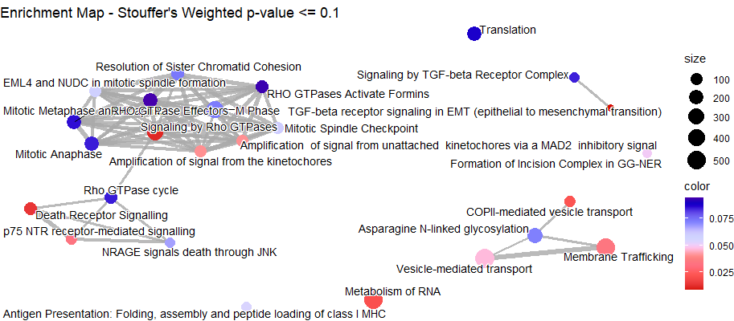

<!--
  %% \VignetteEngine{knitr::knitr}
-->

<style>
<!-- h1, h2, h3, h4 { -->
<!--   color:#17247a; -->
<!-- } -->

strong {
    color:#eb6b1c;
}

</style>

# multiSight 

This vignette is built to be efficient as quickly as 
possible with multiSight.

## Version Info
```{r, echo=FALSE, results="hide", warning=FALSE}
suppressPackageStartupMessages({library('multiSight')})
```
<p>
**R version**: `r R.version.string`
<br />
**Bioconductor version**: `r BiocManager::version()`
<br />
**Package version**: `r packageVersion("multiSight")`
</p>

# Installation

```{r, eval = FALSE}
# To install this package ensure you have BiocManager installed
# if (!requireNamespace("BiocManager", quietly = TRUE))
    # install.packages("BiocManager")

# The following initializes usage of Bioc devel
# BiocManager::install(version='devel')

# BiocManager::install("multiSight")
```

# Why to use **MultiSight** ?

## What is it ?

**MultiSight** is a R package providing an user-friendly graphical interface to 
analyze and explore your omic data sets in a __multi-omic__ manner by _DESEQ2_ 
(see **Biological Insights tab**), machine learning methods with _biosigner_ 
and _multi-block statistical analysis_ (see **Classification tab**) helped by
_p-values pooling Stouffer's_ method.

For each omic data set you furnish, it provides _**classification models**_ 
with *feature selection* you can use as biosignature:

- To forecast phenotypes (e.g. to diagnostic tasks, histological subtyping)
- To design _**Pathways**_ and _**gene ontology**_ **enrichments**
- To build _**Network inference**_ linked to _**PubMed**_ querying to make 
assumptions easier and data-driven.

> You could use this tool with a graphical interface or only with 
script functions.

## App structure 

**MultiSight** enables you to get better biological insights for each omic dataset 
helping by __four analytic modules__ which content:

- __Data input__ & __results__;
- __Classification__ models building;
- __Biological databases__ querying;
- __Network Inference__ & __Pubmed__ querying.

> All result figures and tables could be retrieve in a automatic report.

## What kind of data ? 

All types of omic data respecting input format is supported to build 
**classification models**, **biosignatures** selection and
**network inference**.

- Genomics;
- Transcriptomics;
- Proteomics;
- Metabolomics;
- Lipidomics;

> In fact all numeric matrices.

_You can take a look on data format supported in **Home** tab details._


# Home tab

This is the first tab of **multiSight** you will see.

You could load your biological data and retrieve further your results with an 
automatic HTML and .doc reports.

## Data inputs formats

You have to provide two types of data: **numeric matrices** and 
**classes vector** as csv tables for all **same samples**.

| Omic data 1 |        |        |        |     |
|-------------|--------|--------|--------|-----|
|             | SIGIRR | SIGIRR | MANSC1 |     |
| AOFJ        | 0      | 150    | 1004   | ... |
| A13E        | 34     | 0      | 0      |     |
|             |        | ...    |        |     |

| Omic data 2 |                 |                 |                 |     |
|-------------|-----------------|-----------------|-----------------|-----|
|             | ENSG00000139618 | ENSG00000226023 | ENSG00000198695 |     |
| AOFJ        | 25              | 42              | 423             | ... |
| A13E        | 0               | 154             | 4900            |     |
|             |                 | ...             |                 |     |

| Omic classes |       |
|--------------|-------|
|              | Y     |
| AOFJ         | condA |
| A13E         | condB |
|              | ...   |

## Organism

**multiSight** will download organism database automatically according to your Home 
choice. **19 organism** databases are available (see *Home tab*).
*multiSight* could be used without enrichment analysis and thus without a 
database matching with your data.

## Automatic reports

Result report could be generated in *Home tab* below *data sets input module* 
inside the **Analysis Results** block.

# Classification tab

> This tab is automatically launched after you start analysis in Home tab.

> No click needed, only to explore results.

This tab presents **classification models** to **predict sample classes** 
by numeric values and based upon only a **small subset of features** 
generated by **multiSight** models.

## Model methods

Two types of models have been implemented so far to answer different 
questions: **Biosigner** & **Diablo**.

- To determine *small biosignatures* - Biosigner.
- To build *classification models* in a *multi-omic* way - Diablo.
- To select relevant biological *features* to *enrich* - Diablo.

### Biosigner

[**Biosigner**](https://www.bioconductor.org/packages/release/bioc/html/biosigner.html)
is a R package available in *Bioconductor* project.

_In a single-omic_ manner **Biosigner** computes **SVM** and **Random Forest** 
models helped by feature selection method on omic data sets **one by one**. 

Biological data signatures are obtained for each omic as *union of SVM and RF* 
lists.

> For 3 omic datasets you get 3 models and 3 feature lists (around 5-10 
features by data type). 

### Example

```{r model_biosigner, echo=TRUE, message=FALSE, warning=FALSE}
library(multiSight)

## omic2 is multi-omic data of 2 data sets included in package
data("omic2", package = "multiSight")

## omic2 is multi-omic data of 2 data sets included in package
splittedData <- splitDatatoTrainTest(omic2, freq = 0.8)
data.train <- splittedData$data.train
data.test <- splittedData$data.test

## Build model and one biosignature by omic data set.
biosignerRes <- runSVMRFmodels_Biosigner(data.train)

## Results
biosignerModels <- biosignerRes$model #list of SVM/RF models for each omic.
biosignerFeats <- biosignerRes$biosignature #selected features for each omic.

## Asses model classification performances
biosignerPerf <- assessPerformance_Biosigner(modelList = biosignerModels, 
                                             dataTest = data.test)
print(biosignerPerf) #confusion matrices and performance metrics
```


### Diablo 

In a _multi-omic_ manner **Diablo** method selects relevant features to explain
biological outcome of interest. This is implemented in 
[**mixOmics**](https://www.bioconductor.org/packages/release/bioc/html/mixOmics.html)
R package available in *Bioconductor* project.

*sPLS-DA method* builds a new space for each omic data set by linear 
combinations of initial features giving several components. 
In fact, around 40 features, for each omic, are selected according to
contributions to components to enrich further.

You could retrieve classification **performances** for each model and 
**selected features** by omic data type (e.g. if you have provided 3 omic 
types, you could observe 3 feature lists).

### Example

```{r model_diablo, message=FALSE, warning=FALSE}
library(multiSight)

## omic2 is multi-omic data of 2 data sets included in package
data("omic2", package = "multiSight")
data("diabloRes", package = "multiSight")

splittedData <- splitDatatoTrainTest(omic2, freq = 0.8)
data.train <- splittedData$data.train
data.test <- splittedData$data.test

## Build model and one biosignature by omic data set.
# diabloRes <- runSPLSDA(data.train)
# diabloRes #internal object of package to save time

## Results
diabloModels <- diabloRes$model #sPLS-DA model using all omics.
diabloFeats <- diabloRes$biosignature #selected features for each omic.

## Asses model classification performances
diabloPerf <- assessPerformance_Diablo(splsdaModel = diabloModels, 
                                          dataTest = data.test)
print(diabloPerf) #confusion matrices and performance metrics
```

# Biological insights tab

> The whole tab is 
ready when selected features by classification models are available. 

> Only some clicks needed (Number of omic data sets to choose database)


**Biological Insight** tab is dedicated to give biological sense to your data. 

- You could process ___2 analysis in 2 clicks___: *DESEQ2* and 
*Diablo features* enrichments.

## Biological Annotation Databases

**multiSight** uses so far **several databases** to provide large panel of 
**enrichment analysis** automatically after few clicks:

**Pathways** and **Gene Ontology** databases are implemented, helped by 
**clusterProfiler** and **reactomePA** R Bioconductor packages.

- Kegg;
- Reactome;
- wikiPathways;
- Molecular Function (GO)
- Cellular Component (GO)
- Biological Process (GO)

You could retrieve biological information for **pathways** from these database 
according to organism annotations, see table below:

**multiSight** for enrichment analysis (required only for enrichment) supports 
**19 organism databases**:

| orgDb             | kegg | reactome  | wikipathways             |
|-------------------|------|-----------|--------------------------|
| org.Hs.eg.db      | hsa  | human     | Homo sapiens             |
| org.Mm.eg.db      | mmu  | mouse     | Mus musculus             |
| org.Rn.eg.db      | rno  | rat       | Rattus norvegicus        |
| org.Sc.sgd.db     | sce  | yeast     | Saccharomyces cerevisiae |
| org.Dm.eg.db      | dme  | fly       | Drosophila melanogaster  |
| org.Dr.eg.db      | dre  | zebrafish | Danio rerio              |
| org.Ce.eg.db      | cel  | celegans  | Caenorhabditis elegans   |
| org.At.tair.db    | ath  | x        | Arabidopsis thaliana     |
| org.Bt.eg.db      | bta  | x        | Bos taurus               |
| org.Gg.eg.db      | gga  | x        | Gallus gallus            |
| org.Cf.eg.db      | cfa  | x        | Canis familiaris         |
| org.Ss.eg.db      | ssc  | x        | Sus scrofa               |
| org.EcK12.eg.db   | eck  | x        | Escherichia coli         |
| org.Pt.eg.db      | ptr  | x        | Pan troglodytes          |
| org.Ag.eg.db      | aga  | x        | Anopheles gambiae        |
| org.Pf.plasmo.db  | pfa  | x        | Plasmodium falciparum    |
| org.EcSakai.eg.db | ecs  | x        | Escherichia coli         |
| org.Mmu.eg.db     | mcc  | x        | x                       |
| org.Xl.eg.db      | xla  | x        | x                       |

**Note for enrichment**: only convertible feature names to genes could be enriched 
according to information in organism's database (e.g. *Gene SYMBOL to entrez
ids*; see table below).

You can know _what feature input types are supported_ with this two lines of 
codes if your organism is supported by multiSight.
For instance _org.Hs.eg.db_ for Human provides 26 input names you can use as 
feature names in your data sets.
```{r message=FALSE}
library(org.Mm.eg.db)
columns(org.Mm.eg.db)
```

## **Single-Omic** DESeq2 differential expression analysis

- To compute **differential expression tables by DESeq2** analysis for *several omic
data sets*.
- To **enrich selected features** according to *padjust threshold.*

### Example
```{r multiOmicEnrichment_deseq2, message=FALSE, warning=FALSE}
library(multiSight)

## omic2 is multi-omic data of 2 data sets included in package
deseqRes <- runMultiDeseqAnalysis(omicDataList = omic2, 
                                  padjUser = 0.05)
## One Differential Expression Analysis table for each omic data set
# View(deseqRes$DEtable) 
## One feature selected list for each omic according to padjust user threshold
multiOmic_biosignature <- deseqRes$selectedFeatures
# View(multiOmic_biosignature)

## Multi-omic enrichment
### convert features
dbList <- list(Omic1 = "ENSEMBL",
               Omic2 = "ENSEMBL")
convFeat <- convertToEntrezid(multiOmic_biosignature, dbList, "org.Mm.eg.db")

### ORA enrichment analysis
library(org.Mm.eg.db, warn.conflicts = FALSE)
# database <- c("kegg", "wikiPathways", "reactome", "MF", "CC", "BP")
database <- c("reactome")
multiOmicRes <- runMultiEnrichment(omicSignature = convFeat, 
                                   databasesChosen = database, 
                                   organismDb = "org.Mm.eg.db", 
                                   pvAdjust = 0.05, #default value, optional
                                   minGSSize = 5, #default value, optional
                                   maxGSSize = 800, #default value, optional
                                   pvStouffer = 0.1) #default value, optional
reacRes <- multiOmicRes$pathways$reactome
# mfRes <- multiOmicRes$go$MF
```


## **Multi-Omic** Diablo selected features

- To *enrich selected features* by sPLS-DA multi-block analysis. For each 
linear component computed, for each omic data set, a subset of features is
selected according to variable's contributions.

This tab give an graphical interface where all **multi-omic features** for
selected databases are enriched. You could retrieve **functional enrichment 
results** in Home tab's report and saving module.

```{r multiOmicEnrichment_diablo, message=FALSE, warning=FALSE}
library(multiSight)
data("diabloRes", package = "multiSight")
## omic2 is multi-omic data of 2 data sets included in package
# splittedData <- splitDatatoTrainTest(omic2, 0.8)
# data.train <- splittedData$data.train
# data.test <- splittedData$data.test
# 
# diabloRes <- runSPLSDA(data.train)
# diabloRes #internal object of package to save time
diabloModels <- diabloRes$model #sPLS-DA model using all omics.
diabloFeats <- diabloRes$biosignature #selected features for each omic.

## Multi-omic enrichment
### convert features
names(diabloFeats) #/!\use same names for dbList and omic data sets.
dbList <- list(rnaRead = "ENSEMBL", #feature names origin
               dnaRead = "ENSEMBL")
convFeat <- convertToEntrezid(diabloFeats, 
                              dbList, 
                              "org.Mm.eg.db")

### ORA enrichment analysis for omic feature lists
library(org.Mm.eg.db, warn.conflicts = FALSE)
# database <- c("kegg", "wikiPathways", "reactome", "MF", "CC", "BP")
database <- c("reactome")
multiOmicRes <- runMultiEnrichment(omicSignature = convFeat, 
                                   databasesChosen = database, 
                                   organismDb = "org.Mm.eg.db",
                                   pvAdjust = 0.05, #default value, optional
                                   minGSSize = 5, #default value, optional
                                   maxGSSize = 800, #default value, optional
                                   pvStouffer = 0.1) #default value, optional

## Results
reacRes <- multiOmicRes$pathways$reactome
mfRes <- multiOmicRes$go$MF
```

## Visualizations

Two types of result visualization are given:

- Classical **Enrichment table** for each omic and each database (e.g. 
Pathways id, p-value, padjust columns).
- And, when more than one omic enriched: *Multi-omic table* and *multi-omic
enrichment map* for **DESEQ2** and *Diablo selected features*.

### Multi-Omic Table

A **multi-omic table** is built by annotation database (e.g. reactome) with 
all enrichment results obtained for omic data sets using Stouffer's method.
(**Stouffer's p-value method**)[ https://doi.org/10.1371/journal.pone.0089297]
consists in *p-values pooling* for same pathways or 
ontology. 
In fact, a Stouffer's value is computed for every biological 
annotations shared by at least 2 enrichment analysis tables (NOTE: each omic 
data enriched has one usual enrichment analysis table by selected database).

Thereby, you could **summarize information for several data sets** and 
enrichment results. 

| ID            | Description                                                               | p-value:Omic1 | p-value:Omic2 | Stouffer | StoufferWeighted | geneID                             | GeneRatio | Count |
|---------------|---------------------------------------------------------------------------|---------------|---------------|----------|------------------|------------------------------------|-----------|-------|
| R-MMU-2173791 | TGF-beta receptor signaling in EMT (epithelial to mesenchymal transition) | 0.043         | 0.047         | 0.008    | 0.008            | 102098/11848/16456/18762/21803/... | 2/60      | 2     |
| R-MMU-194315  | Signaling by Rho GTPases                                                  | 0.096         | 0.029         | 0.011    | 0.011            | 100043813/101497/102098/102920/... | 1/60      | 1     |
| R-MMU-73887   | Death Receptor Signalling                                                 | 0.056         | 0.06          | 0.013    | 0.013            | 101497/102098/106025/109934/11491/ | 2/60      | 2     |
| R-MMU-8953854 | Metabolism of RNA                                                         | 0.533         | 0.002         | 0.024    | 0.021            | 100043813/100044627/100502825/...  | 1/60      | 1     |

Each value is similar to a *enrichRes* object obtained by *clusterProfiler*, in
fact Stouffer's results are transformed as *enrichRes** objects and could be used 
for usual *enrichRes* analysis and visualization functions.

Note in our *cytoscape-like case* that *geneID* column refers to all genes in 
pathways or ontology named in database annotations. In usual *enrichRes* this 
column presents genes enriched contributing in pathways.

A graphical network is build according this table as a **Enrichment Map**.

### Multi-Omic enrichment map

**Enrichment map** is a graph drawn to observe pathways or ontologies 
relationships according to overlapping elements in each parts.

Each pathway is a node and a bond is built between them if there have 
common genes (see *Jaccard similarity coefficient - JC's similarity* method).

Here, enrichment map functions from *enrichPlot* package are adapted to draw 
similar map to **cytoscape** add-on (*EnrichmentMap*)[https://journals.plos.org/plosone/article?id=10.1371/journal.pone.0013984]: 
all genes in each pathways are used to compute similarity.


> Each Stouffer Enrichment Map (one for each enrichment database) could be
retrieve in report automatically generated and in Home tab to be saved.

# Assumption tab

> Some clicks(from 4 to number of pubmed queries)

**Assumption tab** aims to help biological hypothesis making by *network 
inference* with feature relation values (e.g correlation, partial correlation)
and *PubMed module* linked to relation tables.

Tools:

- To compute _*network inference*_ and reveal feature relationships.
- To get _*Pubmed articles*_ based on your personalized query without leaving 
app.

```{r networkInference, message=FALSE, warning=FALSE}
library(multiSight)
data("omic2", package = "multiSight")
data("diabloRes", package = "multiSight")
## omic2 is multi-omic data of 2 data sets included in package
splittedData <- splitDatatoTrainTest(omic2, 0.8)
data.train <- splittedData$data.train
data.test <- splittedData$data.test

## Build diablo models
# diabloRes <- runSPLSDA(data.train)
diabloFeats <- diabloRes$biosignature #selected features for each omic.

## Build biosigner models
biosignerRes <- runSVMRFmodels_Biosigner(data.train)
biosignerFeats <- biosignerRes$biosignature #selected features for each omic.

## Network inference
### Diablo features
concatMat_diablo <- getDataSelectedFeatures(omic2, diabloFeats)
corrRes_diablo <- correlationNetworkInference(concatMat_diablo, 0.85)
pcorRes_diablo <- partialCorrelationNI(concatMat_diablo, 0.4)
miRes_diablo <- mutualInformationNI(concatMat_diablo, 0.2)

### Biosigner features
concatMat_biosigner <- getDataSelectedFeatures(omic2, biosignerFeats)
corrRes_bios <- correlationNetworkInference(concatMat_biosigner, 0.85)
pcorRes_bios <- partialCorrelationNI(concatMat_biosigner, 0.4)
miRes_bios <- mutualInformationNI(concatMat_biosigner, 0.2)

corrRes_diablo$graph
```

# Session info {.unnumbered}

Here is the output of `sessionInfo()` on the system on which this document was
compiled running pandoc `r rmarkdown::pandoc_version()`:

```{r sessionInfo, echo=FALSE}
sessionInfo()
```